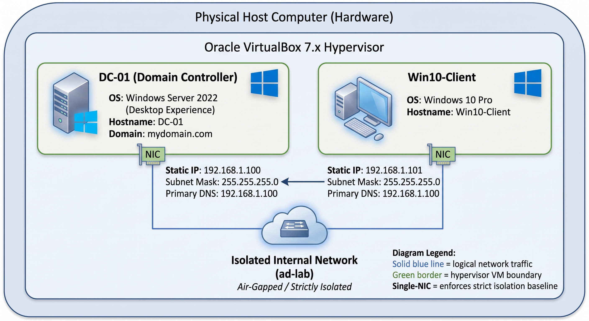

# enterprise-ad-lab
Enterprise Windows Server 2022 &amp; Win10 lab showcasing Active Directory management, PowerShell bulk provisioning, GPO enforcement, and Jira IT support workflows.

## 📑 Table of Contents
- [Project Overview](#project-overview)
- [Key Objectives](#key-objectives)
- [Architecture & Environment Setup](#architecture--environment-setup)
- [Implementation Steps](#implementation-steps)
- [Lab Incident Reports (Help Desk Simulation)](#lab-incident-reports-help-desk-simulation)
- [Lessons Learned & Troubleshooting (My Takeaway)](#lessons-learned--troubleshooting-my-takeaway)
- [Acknowledgments](#acknowledgments)

---
## 📌 Project Overview
As an aspiring IT support professional transitioning into infrastructure administration, I engineered this laboratory environment to simulate a production-grade enterprise network. Moving beyond passive learning, the primary objective is demonstrating hands-on competency in **Active Directory domain management**, identity provisioning, and access control policies. To achieve this, I manually architected a secure domain, implemented automated user provisioning via PowerShell, and enforced access restrictions through Group Policies (GPOs) inside an isolated virtualized environment.

## 🎯 Key Objectives
* **Core Directory Services:** Deploy and promote a Windows Server instance to a Domain Controller (DC).
* **Identity Management & DNS:** Establish internal name resolution and secure client-to-domain integration.
* **Automation:** Scale user provisioning using a custom PowerShell batch script (moving away from manual GUI "click-ops").
* **Endpoint Security:** Enforce security compliance via Group Policy Objects (GPOs) to proactively reduce help desk ticket volume.

## 🏗️ Architecture & Environment Setup
* **Hypervisor:** Oracle VirtualBox 7.x
* **Network Topology:** Isolated Internal Network (`ad-lab`), single-NIC setup per VM to enforce strict isolation and security baselines.
* **Domain Name:** `mydomain.com`
* **Server (DC-01):** Windows Server 2022 (Desktop Experience) | Static IP: `192.168.1.100`
* **Client (Win10-Client):** Windows 10 Pro | Static IP: `192.168.1.101` | Primary DNS: `192.168.1.100`

## 🚀 Implementation Steps

### Phase 1: Virtualization & Isolated Networking
Instead of relying on a standard bridged or complex dual-NIC setup, I configured a dedicated internal switch (`ad-lab`) in VirtualBox. This ensures the environment mirrors a secure, air-gapped corporate lab where traffic is tightly controlled between the domain controller and endpoints.

### Phase 2: Domain Controller Promotion & DNS Baseline
1. Installed AD DS and DNS Server roles on Windows Server 2022 via Server Manager.
2. Promoted the server to a Domain Controller for the forest `mydomain.com`, setting up the Directory Services Restore Mode (DSRM) administrator credentials.
3. Configured static IP addressing (`192.168.1.100`) and pointed the local DNS client settings to loopback/itself (`127.0.0.1` / `192.168.1.100`).

### Phase 3: Client Integration & Domain Join
1. Configured the Windows 10 Pro virtual machine with a static IP (`192.168.1.101`) on the same internal network, pointing its primary DNS directly to the Domain Controller (`192.168.1.100`).
2. Verified name resolution and connectivity via command-line tools:
   * `ping 192.168.1.100` (Packet loss: 0%)
   * `nslookup mydomain.com` (Successfully resolved to the DC IP).
3. Joined the machine to `mydomain.com` using administrative domain credentials and performed a clean system reboot to establish the secure trust relationship.

### Phase 4: Bulk User Automation via PowerShell
Manual object creation does not scale in enterprise environments. To eliminate provisioning bottlenecks and handle identity management efficiently, the following automated workflow was implemented:
1. Prepared a raw `.txt` file containing a simple list of first and last names, simulating unstructured data handoffs from HR.
2. Executed a custom administrative PowerShell script ([view script.ps1 here](./scripts/script.ps1)) that parses the text file, dynamically generates standard usernames (first initial + last name), and utilizes the Active Directory module (`New-ADUser`) to programmatically provision user accounts in bulk with a standardized secure password.
3. Validated account creation and group memberships via Active Directory Users and Computers (ADUC).

### Phase 5: Group Policy Enforcement (GPO)
1. Created a dedicated GPO titled "Block Control Panel" via Group Policy Management Console (`gpmc.msc`).
2. Linked the policy to the target user Organizational Unit.
3. Configured user configuration administrative templates to prohibit access to the Control Panel and PC settings, preventing end-users from altering system configurations and directly reducing Level 1 support ticket volume.
4. Forced policy replication on the client using `gpupdate /force` and validated restriction compliance.

---

## 🛠️ Lab Incident Reports (Help Desk Simulation)
To demonstrate practical troubleshooting and ticket management, I simulated and resolved real-world user issues using Jira Cloud for documentation:

* 📄 **[Ticket #001: Account Lockout Resolution](./docs/ticket-001.md)**
* 📄 **[Ticket #002: Shared Folder Access Request](./docs/ticket-002.md)**
* 📄 **[Ticket #003: Software Installation Request (UAC Bypass)](./docs/ticket-003.md)**

---

## 💡 Lessons Learned & Troubleshooting (My Takeaway)
Building this from scratch came with a few real-world friction points that reinforced my troubleshooting methodology:

* **DNS is Everything:** During the domain join phase, I ran into credential validation blocks. Using `nslookup` immediately exposed whether the client was talking to the correct DNS authority. In an AD environment, if DNS isn't healthy, nothing else works.
* **Naming Conventions & Account Scopes:** Explicitly declaring the domain prefix (`mydomain.com\username`) during administrative tasks saved time and prevented local vs. domain account permission collisions.
* **Active Directory as a Support Hub:** Through simulating user incidents, I realized ADUC is the central nervous system for daily help desk operations. Handling lockouts, password resets, and file share provisioning directly translated theoretical AD knowledge into practical Tier 1/Tier 2 support workflows.
* **Ticketing Discipline (Jira):** Resolving the technical issue is only half the job. Logging the diagnostic steps, documenting the remediation, and leaving clear internal notes in Jira reinforced the importance of maintaining a solid audit trail, tracking SLAs, and ensuring clear communication across the IT team.

**The Bigger Picture:**
Beyond resolving specific technical roadblocks, architecting this lab reinforced a fundamental IT philosophy: proactive infrastructure management is always superior to reactive troubleshooting. By shifting from manual GUI configurations to PowerShell automation and enforcing strict GPOs, I experienced firsthand how scalable design directly reduces Level 1 ticket volume. More importantly, executing and documenting these simulated incidents in a ticketing system solidified my readiness to step directly into an IT Support / Help Desk role, equipped with both the technical foundation and the procedural discipline required in a modern corporate environment.

## 🤝 Acknowledgments
* The mock HR user dataset and foundational concepts for the PowerShell provisioning automation were inspired by [Josh Madakor's Active Directory Lab](https://github.com/joshmadakor1/AD_PS/).
