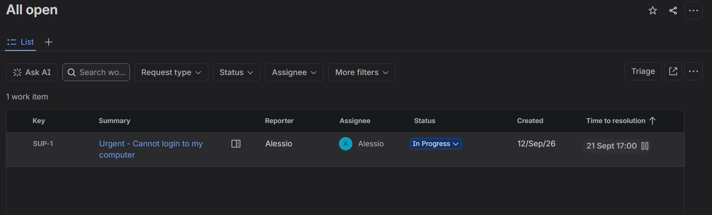
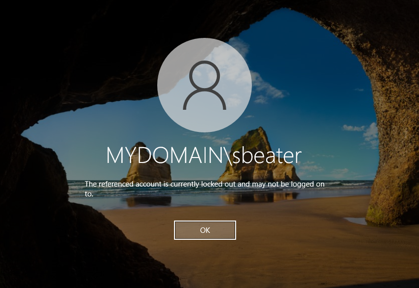
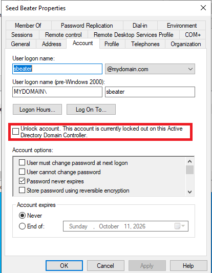
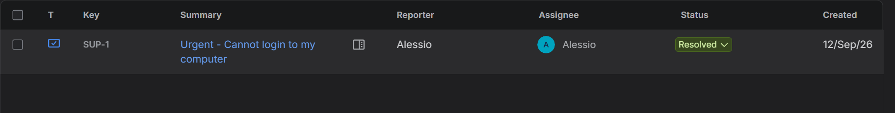
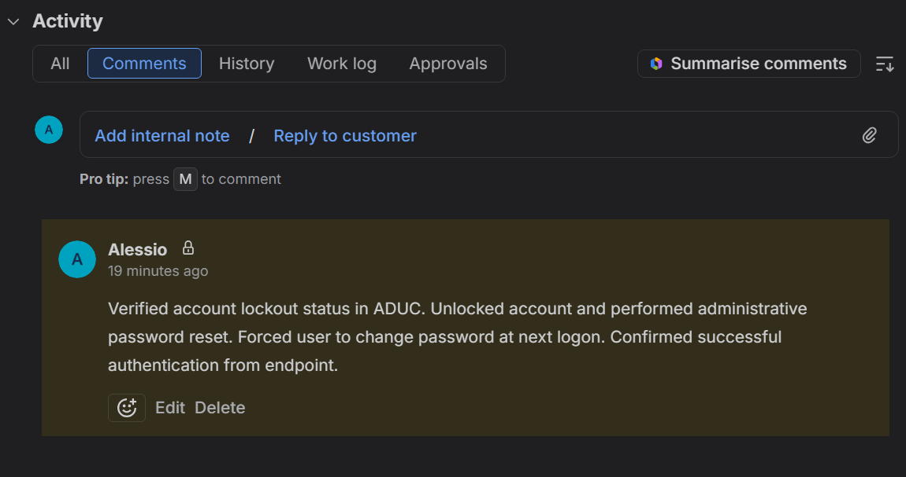

# Lab Incident Report: Account Lockout Resolution (Ticket #001)

## 1. Incident Overview & Triage (Jira Cloud)
* **Ticket ID:** SUP-1
* **Issue Type:** Incident / IT Help
* **Summary:** Urgent - Cannot login to my computer
* **Description:** User reported an account lockout after multiple incorrect password attempts prior to an urgent meeting.
* **Actions Taken:** 
  * Ticket created, assigned to support engineer, and transitioned from Open to In Progress.
  * Simulated user authentication failure on the Windows 10 Client (`sbeater`), triggering the native domain lockout policy ("The referenced account is currently locked out").
* **Deliverable / Screenshots:** 
  * Triage confirmation in Jira showing active assignment and status. 
  * Endpoint validation capturing the Windows 10 lockout error message. 

## 2. Investigation & Remediation (Active Directory - DC-01)
* **Environment:** Windows Server Domain Controller (`DC-01`), Active Directory Users and Computers (ADUC).
* **Diagnostic Steps:**
  * Navigated to the designated Organizational Unit (OU) and located target user `sbeater`.
  * Verified account status in the Account tab, confirming the active security flag: *"Unlock account. This account is currently locked out on this Active Directory Domain Controller"*.
* **Remediation Steps:**
  * Checked *Unlock account* and applied configuration changes.
  * Performed an administrative password reset with a secure temporary credential (`TempPass123!`).
  * Enforced policy compliance by selecting *User must change password at next logon* (ensuring "Password never expires" was unchecked).
* **Deliverable / Screenshot:** 
  * * ADUC properties window capturing the active lockout state prior to administrative intervention.
   

## 3. Verification & Documentation (Jira Cloud)
* **Endpoint Testing:** Logged into the Windows 10 Client using the temporary credential, verifying that Windows immediately forced an interactive password update.
* **Audit Trail Check:** Confirmed successful domain authentication via Event Viewer on `DC-01` (Security Logs, Event ID 4624).
* **Resolution & Closure:**
  * Added a mandatory internal technical note to the Jira ticket:
    > "Verified account lockout status in ADUC. Unlocked account and performed administrative password reset. Forced user to change password at next logon. Confirmed successful authentication from endpoint."
  * Configured global resolution status (`Done`) and transitioned the ticket workflow state to Resolved.
* **Deliverable / Screenshot:** 
  * Final closed Jira ticket displaying the internal yellow/grey documentation note and *Resolved* status. 
