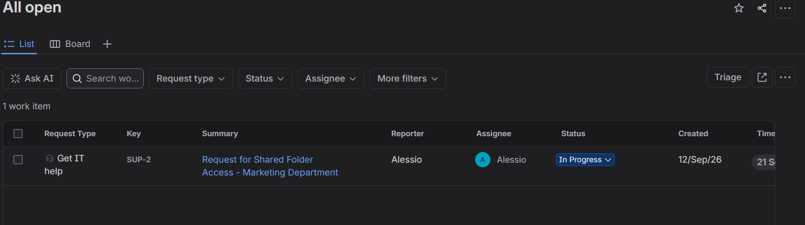
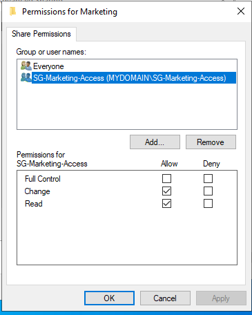
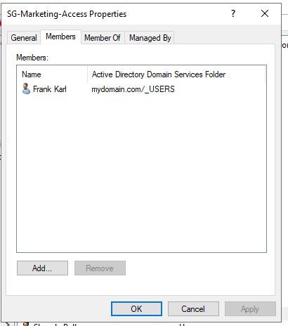
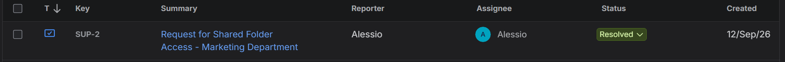
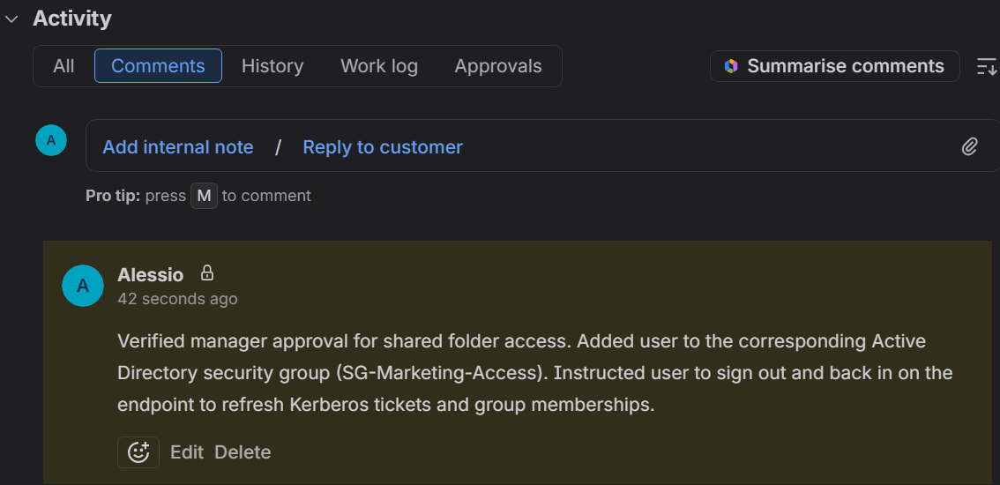

# Lab Incident Report: Shared Folder Access Request (Ticket #002)

## 1. Incident Overview & Triage (Jira Cloud)
* **Ticket ID:** SUP-2
* **Issue Type:** Service Request / IT Support
* **Summary:** Request for Shared Folder Access - Marketing Department
* **Description:** User Frank Karl requested access to the departmental shared folder (`\\DC-01\Marketing`) to collaborate on upcoming campaign files. Manager approval has been verified.
* **Actions Taken:** 
  * Ticket created, assigned to support engineer, and transitioned from Open to In Progress.
  * Verified manager approval for departmental resource provisioning.
* **Deliverable / Screenshots:** 
  * Triage confirmation in Jira showing active assignment and status:
    

## 2. Investigation & Remediation (Active Directory & File Server - DC-01)
* **Environment:** Windows Server Domain Controller (`DC-01`), Active Directory Users and Computers (ADUC), File Server.
* **Diagnostic Steps:**
  * Checked current user authorization and verified the target directory (`\\DC-01\Marketing`).
  * Confirmed the resource is governed by the Active Directory security group `SG-Marketing-Access` with appropriate share and NTFS permissions (Change/Read).
* **Remediation Steps:**
  * Navigated to the designated Organizational Unit in ADUC and located the security group `SG-Marketing-Access`.
  * Added the target user (Frank Karl) to the group via the Members tab.
  * Applied and saved the configuration.
* **Deliverable / Screenshots:** 
  * Folder permissions showing Change and Read access for the security group:
    
  * ADUC properties window showing user Frank Karl added to the security group members list:
    

## 3. Verification & Documentation (Jira Cloud)
* **Endpoint Testing:** Logged into the Windows 10 Client as Frank Karl to refresh Kerberos tickets. Navigated to `\\DC-01\Marketing` and successfully created a test file, confirming effective write/modify access.
* **Resolution & Closure:**
  * Added a mandatory internal technical note to the Jira ticket:
    > "Verified manager approval for shared folder access. Added user Frank Karl to the corresponding Active Directory security group (SG-Marketing-Access). Instructed user to sign out and back in on the endpoint to refresh Kerberos tickets and group memberships."
  * Configured global resolution status (`Done`) and transitioned the ticket workflow state to Resolved.
* **Deliverable / Screenshots:** 
  * Final closed Jira ticket displaying the Resolved status:
    
  * Internal yellow/grey documentation note confirming resolution details:
    
