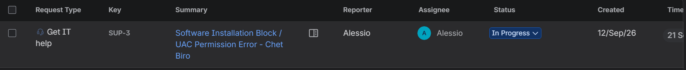
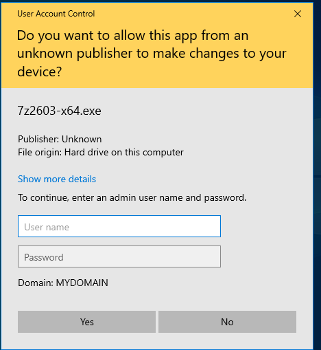
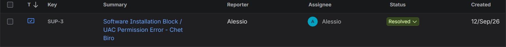
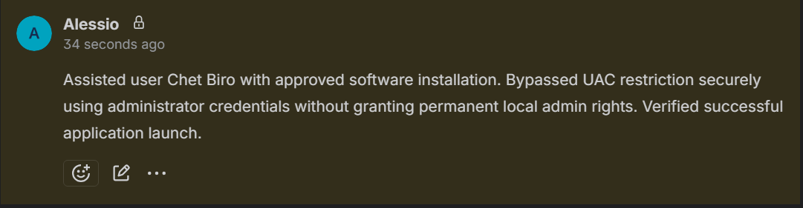

# Lab Incident Report: Software Installation Request (Ticket #003)

## 1. Incident Overview & Triage (Jira Cloud)
* **Ticket ID:** SUP-3
* **Issue Type:** Service Request / IT Support
* **Summary:** Software Installation Block / UAC Permission Error - Chet Biro
* **Description:** User Chet Biro (`cbiro`) requested assistance to install an approved corporate utility (7-Zip) on `Win10-Client`, but the installation was blocked by standard user restrictions.
* **Actions Taken:** 
  * Ticket created, assigned to support engineer, and transitioned from Open to In Progress.
  * Verified software approval policy for the departmental user profile.
* **Deliverable / Screenshots:** 
  * Triage confirmation in Jira showing active assignment and status:
    

## 2. Investigation & Remediation (Endpoint & UAC - Win10-Client)
* **Environment:** Windows 10 Client (`Win10-Client`), User Account Control (UAC).
* **Diagnostic Steps:**
  * Logged into the endpoint using the standard user account (`cbiro`) to replicate the restriction.
  * Attempted to execute the installer package, which triggered a User Account Control (UAC) prompt requiring administrative credentials.
* **Remediation Steps:**
  * Intervened securely via remote support session without granting permanent local administrator privileges to the user.
  * Authenticated directly inside the UAC prompt using domain administrator credentials to authorize the temporary installation context.
* **Deliverable / Screenshots:** 
  * UAC prompt requiring administrative credentials on the endpoint:
    

## 3. Verification & Documentation (Jira Cloud)
* **Endpoint Testing:** Verified that the application installed successfully into the system directory and launched correctly under the user session for Chet Biro.
* **Resolution & Closure:**
  * Added a mandatory internal technical note to the Jira ticket:
    > "Assisted user Chet Biro with approved software installation. Bypassed UAC restriction securely using administrator credentials without granting permanent local admin rights. Verified successful application launch."
  * Configured global resolution status (`Done`) and transitioned the ticket workflow state to Resolved.
* **Deliverable / Screenshots:** 
  * Final closed Jira ticket displaying the Resolved status:
    
  * Internal yellow/grey documentation note confirming resolution details:
    
